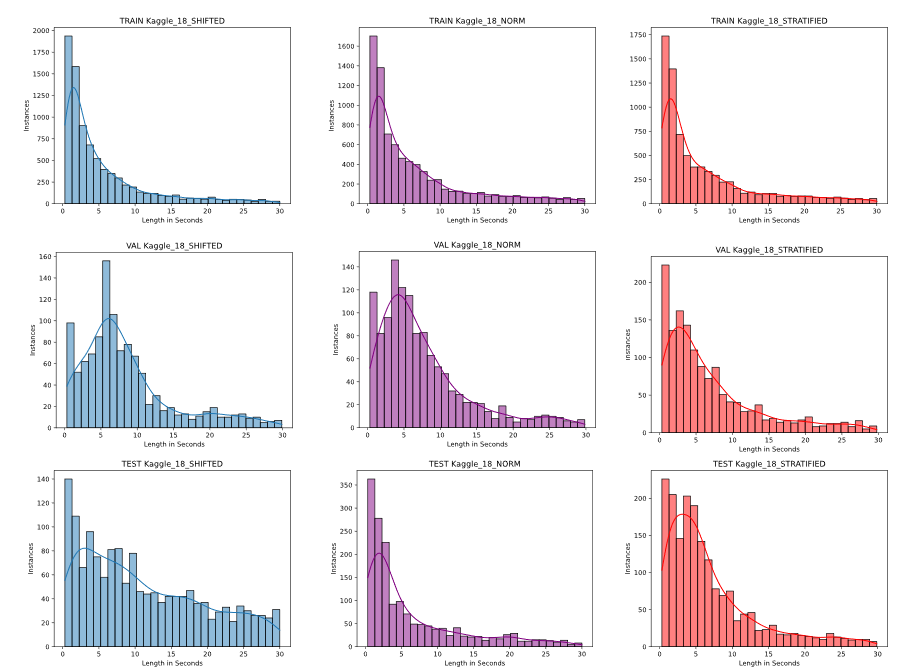

## Sample Length Aware Splits

Here we have the length distribution shifted and stratified dataset splits as well as the codes used to create them. 

The idea behind defining these splits was to investigate how either similar or mismatched sample length distributions between train and test times impacted performance of our models. For each variable length dataset (Kaggle18, VoxCeleb1, BirdClef2020) we define both a shifted and stratified split:
  - Shifted: Making difference between train and test distributions larger
  - Stratified: Making difference smaller
  
## Creation Of The Splits
Actually creating these splits can easily become a fairly complex optimisation problem itself, however to avoid this and the time/computational costs associated we take a simple and intuitive approach. This is outlined more in the paper however the basic methodology is as follows:
  - Calculate an expected average sample length for each class based on some % of its total samples (using all samples for some classes renders poorer overall results, opt to use 60% based on some tuning)
  - Sort these expected averages in ascending or descending order
  - Two different options for shift/strat:
  -   For shift, take first n classes in the sorted list to reach desired training ratio of full set of classes, repeat with leftover classes for validation and then finally testing. Taking training first and leaving testing to last should create a natural distribution shift with respect to sample lengths
  -   For each split element in strat (train/val/test), select classes from both sides of the sorted list each time a selection is made and repeat until desired ratios are met. The intuition here is that the expected shortest length class is in the same split as the longest, and so on, creating a widened but more uniform distribution for all splits. It is worth noting that quantitative values (expected distribution values) can be generated for each split as a way of validating our simple approach, these are automatically given from our length_dist.py file. 

## Files
Included in the Codes folder are the scripts for both the creation and visualisation of the sample length aware splits. Specifically we include the following scripts:
  - dist_search.py (Responsible for actually generating the new splits)
  - length_dist.py (Visualises some dataset split)
  - utils.py (Some basic utility functions to be used with dist_search.py)

## Example 

Below is an example illustrating these splits for the Kaggle18 dataset. We chose this dataset as its small size allows the differences between the splits to be more easily be seen. In the middle we have the normal (random) split and on the left/right we have the shifted/stratified respectively.  Comparing both of our newly defined split to the random split we can see the explicit effects we were hoping for:
  - The train and test distributions have a significantly larger difference between them than in found in the random split, or by extension the stratified split
  - The stratified split, over all train/val/test, is more uniform with expected value peaks all much closer in value than in the random split (where validation was a bit of an outlier)

